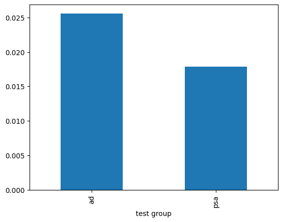
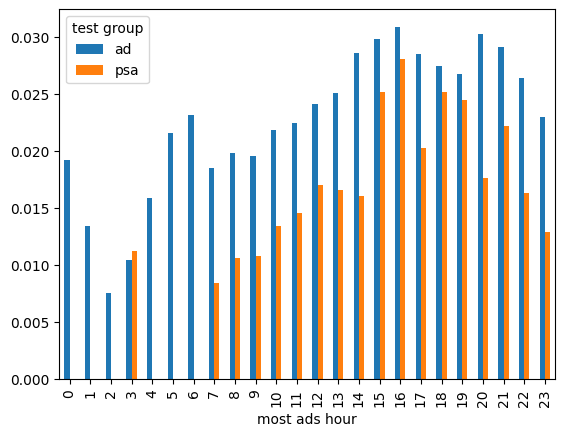
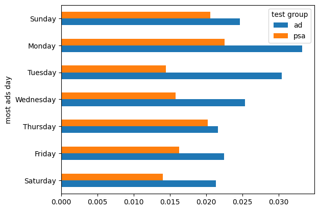

# T&D Teste A/B

Este repositório contém um experimento de **Teste A/B** realizado como parte do programa de **Treinamento e Desenvolvimento (T&D)** da equipe. O objetivo foi avaliar o impacto da exposição a diferentes tipos de anúncios na taxa de conversão de usuários.

---

## 📊 Dataset

- Fonte: [Kaggle - Marketing A/B Testing](https://www.kaggle.com/datasets/faviovaz/marketing-ab-testing/data)  
- Cada linha representa um **usuário**.  
- Colunas disponíveis:
  - `user_id`: identificador único do usuário  
  - `test group`: grupo de teste (`ad` ou `psa`)  
  - `converted`: indicador de conversão (0 ou 1)  
  - `total ads`: número total de anúncios vistos  
  - `most ads day`: dia da semana em que mais viu anúncios  
  - `most ads hour`: hora do dia em que mais viu anúncios  

---

## 🛠️ Bibliotecas Utilizadas

- `pandas`  
- `numpy`  
- `math`  
- `matplotlib`  

---

## 🔎 Análise Exploratória

1. **Valores faltantes**: não foram encontrados.  
2. **Estatísticas descritivas**: identificados outliers em `total ads`, mas sem impacto relevante para a análise.  
3. **Independência dos dados**: todos os usuários são únicos.  
4. **Distribuição por grupo**:
   - Grupo **ad** (expostos a anúncios): **564.577 usuários**  
   - Grupo **psa** (expostos apenas a anúncios públicos): **23.524 usuários**  

Apesar do desbalanceamento, a amostra do grupo de controle é suficiente para um **Z-test de proporções**.

---

## 🎯 Definição do Teste

- **Métrica de sucesso**: Taxa de conversão  
- **Hipóteses**:  
  - \( H_0 \): Não há diferença na taxa de conversão entre os grupos  
  - \( H_1 \): Há diferença na taxa de conversão entre os grupos  

---

## 🧮 Resultados Estatísticos

1. Diferença observada nas taxas de conversão: **0,0077** (≈ 0,77 p.p.).  
2. Estatística do teste: **Z = 7,37**.  
3. p-valor: **1,705e-13** (\(p < 0,0001\)).  
4. Intervalo de confiança (95%): **[0,0060 ; 0,0094]**.  

✅ Rejeitamos \( H_0 \) e concluímos que a diferença é **estatisticamente significativa**.  

---

## 📈 Visualizações

Foram gerados gráficos para explorar os padrões de conversão:  

### Conversão por grupo de teste

### Conversão por hora do dia

### Conversão por dia da semana

### Conversão por intervalo de anúncios vistos

### Principais insights:
- **Segundas e terças-feiras** apresentam taxas de conversão mais altas.  
- Horários entre **14h–16h** e **20h–21h** são mais propensos à conversão.  
- No grupo **ad**, a taxa de conversão aumenta conforme o número de anúncios vistos.  
- No grupo **psa**, esse comportamento não se repetiu.  

---

## ✅ Conclusão

Os resultados indicam uma **diferença estatisticamente significativa** entre os grupos de teste e controle.  

- Diferença de conversão: **0,77 p.p.**  
- Intervalo de confiança (95%): **[0,60%, 0,94%]**  
- Significância estatística confirmada (\(p < 0,0001\))  
- Evidência de **relevância prática**: a variação testada impacta positivamente a taxa de conversão.  

---

📌 **Resumo final**: O experimento mostra que a exposição a anúncios aumenta a taxa de conversão, e que existem dias e horários estratégicos para intensificar campanhas.  

## 🙋🏻‍♂️ Autor

**Éric Fadul Cunha Yoshida** • [GitHub @faduzin](https://github.com/faduzin) • [LinkedIn](https://www.linkedin.com/in/ericfadul) 